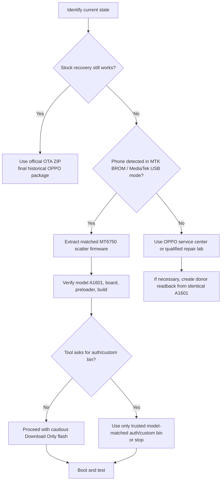

# OPPO A1601 Authentication File Recovery Research Report

## Executive summary

`A1601` is the **OPPO F1s**, an aging MediaTek handset whose public recovery ecosystem is fragmented and frequently mislabeled. After searching official OPPO support and regional support surfaces, historical OPPO download references, major firmware repositories, XDA, GSMHosting, Whirlpool, Martview, Telegram-indexed channels, Reddit, and archive-oriented web results, I did **not** find a clearly official, model-specific public `.auth` file for the OPPO A1601. What I did find were historical **official OTA/recovery ZIPs**, many **mirrored scatter/service firmware packages** from build A.15 through A.42, one third-party **“No Auth Firmware”** listing, one tiny model-specific **`custom.bin`** download, and one **generic auth bundle** that merely lists A1601 among many OPPO models. citeturn32search12turn43search7turn17search0turn25search5turn41view0

The most important technical finding is that several live-service logs for real A1601 devices show **`SecureBoot: True`** but **`DA Auth: False`** or **`DAA: False`**, after which the tools proceed with `MTK_AllInOne_DA.bin`, read the partition table, and identify the handset as `Model: A1601`, `Platform: mt6750`. In practical terms, that means a separate standalone auth file may **not actually be required** for many legitimate A1601 recovery cases, even though repair sites market “auth,” “custom bin,” or “no-auth” packages for it. citeturn40view0turn40view1turn40view2

The safest conclusion is therefore conservative: if **stock recovery still works**, prefer the historical OPPO OTA package path; if the phone is **soft-bricked but still enumerates in BROM**, use a **matched scatter/service firmware** only after verifying model, chipset, board, and build consistency; and if the phone is **hard-bricked** or you truly need vendor-side authorization, **OPPO service center reflashing** is the most defensible route. OPPO’s current official PC upgrade assistant is for **ColorOS 11 or later**, so it is not a realistic tool for the F1s, which shipped on **ColorOS 3 / Android 5.1** and was manually upgradable to Android 6.0. citeturn37search21turn39search0turn31search3turn19search3

## Evidence and search findings

The clearest **official** recoverable artifacts are not auth files at all, but **historical OTA/recovery packages**. Community posts preserved OPPO-hosted S3 URLs for `A1601EX_11_OTA_001_all_201703281552_wipe.zip` and `A1601EX_11_OTA_002_all_201704120142_wipe.zip`, while archived support references show official public listings for A.37, A.40, and A.41 with sizes around **1.4–1.5 GB**. None of the official references I found expose a public `.auth`, `auth_sv5.auth`, OPPO DA bundle, or A1601-specific service credential. citeturn23search8turn38search3turn11view1turn27search3turn17search0

The mirror ecosystem is much richer than the official one, but also much less trustworthy. HalabTech, GSM-Firmware, GBFirmware, ROMDevelopers, AndroidFileHost, FirmwareFile, NeedROM, and Filewale all surface A1601-related packages, including scatter-like service firmware, mirror copies of OTA ZIPs, boot files, and small “custom bin” artifacts. The strongest auth-adjacent signal in that set is **HalabTech’s `OPPO A1601EX No Auth Firmware`** listing, but that is still a third-party repair repository—not an OPPO publication—and it is notable precisely because it advertises recovery **without** auth rather than publishing an official auth token. citeturn36search12turn30search5turn30search9turn35view0turn25search5turn45search0

There is also repeated **mislabeling**. Some pages call A1601 “F1 Plus,” some attach `X9009`, and some write `MT6755`, but live-device logs consistently identify the phone as **`A1601` on `mt6750`**, with preloader names such as `preloader_oppo6750_15131.bin`, and public spec databases identify A1601 as the **OPPO F1s**. That mismatch is not academic: it is exactly how users end up flashing the wrong preloader, the wrong scatter, or the wrong partition map. citeturn32search12turn40view0turn40view1turn35view2turn42view0

A final point matters a great deal for recovery planning: several A1601 forum and tool logs show that the phone can be accessed in **BROM** with **`SLA: False`** and **`DAA/DA Auth: False`**, and some tools explicitly report **“Disable Auth Success”** before continuing. I am treating that as an observational fact about the device and toolchain, not as a recommendation to use bypass tooling. For legitimate recovery, it means the lack of a public `.auth` file is not automatically fatal on this model. citeturn40view0turn40view1turn18search2

## Candidate download table

The table below collapses duplicate reposts and near-identical mirrors into the most useful distinct candidates I found.

| URL | Host | File name | Size | File type | Contains auth file | Checksum | Date | Notes on authenticity and risk |
|---|---|---|---:|---|---|---|---|---|
| `http://downloads.oppo.com.s3.amazonaws.com/firmware/A1601%206.0/A1601EX_11_OTA_001_all_201703281552_wipe.zip` | OPPO S3 | `A1601EX_11_OTA_001_all_201703281552_wipe.zip` | ~1.5 GB mirror copy | Official historical OTA / recovery ZIP | No | Mirror MD5: `50a2097a0d423ed314b319ed0a7fa452` | 2017-03-28 | Historical **official** URL preserved by XDA, Whirlpool, and other community references. This is a **wipe** package for recovery-style updating, not a scatter/auth bundle. High confidence as a real historical OPPO package; low availability confidence today. citeturn17search0turn23search8turn35view1 |
| `http://downloads.oppo.com.s3.amazonaws.com/firmware/A1601%206.0/A1601EX_11_OTA_002_all_201704120142_wipe.zip` | OPPO S3 | `A1601EX_11_OTA_002_all_201704120142_wipe.zip` | Not published in the sources I found | Official historical OTA / recovery ZIP | No | — | 2017-04-12 | Historical **official** URL referenced from OPPO AU/SG announcement paths via community threads. Intended for manual recovery/upgrade, not for SP Flash Tool auth workflows. High confidence as a real historical OPPO path. citeturn38search3turn43search16turn38search8 |
| `https://androidfilehost.com/?fid=11410963190603863245` | Android File Host | `Oppo_F1S_A1601_(A1601EX_11_A.16_160920)_by_(FirmwareOS.com).zip` | 1.5 GB | Mirrored stock/scatter firmware ZIP | No explicit auth | `9a9615ad062a062eea00c6fd12a57388` | Upload 2018-12-01 | Medium-risk mirror. Useful because it exposes a concrete hash, but it is an uploader-hosted copy, not a vendor-signed OPPO endpoint. citeturn35view0 |
| `https://androidfilehost.com/?fid=11410963190603863341` | Android File Host | `Oppo_F1S_A1601_(A1601EX_11_A.33_170814)_by_(FirmwareOS.com).zip` | 1.5 GB | Mirrored stock/scatter firmware ZIP | No explicit auth | `549bcb3680c7ed4ca16f15c4602cb9a7` | Upload 2018-12-01 | Same trust posture as the A.16 mirror: individually uploaded, hashed, but not official. Useful mainly as an integrity-checked mirror. citeturn34view0 |
| `https://firmwarefile.com/oppo-a1601-f1s` | FirmwareFile | `Oppo_F1S_A1601_MT6750_EX_11_A.15_160913.zip` | 2.0 GB | Stock ROM page with mirrors | No explicit auth | — | Listed 2016 build / page current | Secondary repository that explicitly lists A.15 and A.24 as MT6750 SP Flash Tool packages. Helpful for discovery; trust depends on the downstream mirror retrieved from the page. citeturn45search4 |
| `https://firmwarefile.com/oppo-a1601-f1s` | FirmwareFile | `Oppo_F1S_A1601_MT6750_EX_11_A.24_161119.zip` | 2.0 GB | Stock ROM page with mirrors | No explicit auth | — | Listed 2016 build / page current | Same discovery page as above. Useful because it names MT6750 explicitly, but still a third-party mirror directory, not a primary source. citeturn45search4 |
| `https://gsm-firmware.com/index.php?a=downloads&b=file&id=62722` | GSM-Firmware | `A1601EX_11_OTA_041_all_201912261125.zip` | 1.45 GB | Mirrored OTA/recovery ZIP | No | — | 2021-01-05 | Likely a mirror of the late official A.41 OTA package. Moderate utility, but still secondary. Better than random blogs because it preserves filename, size, and date. citeturn44search0 |
| `https://gsm-firmware.com/index.php?a=downloads&b=file&id=59518` | GSM-Firmware | `A1601EX_11_A.41_191226.rar` | 1.58 GB | Mirrored full/service firmware RAR | No explicit auth | — | 2020-08-03 | Full-flash style package. More useful for SP Flash Tool than OTA ZIPs, but provenance is weaker than the official recovery packages. citeturn30search2 |
| `https://support.halabtech.com/index.php?a=downloads&b=file&id=311725` | HalabTech | `A1601EX_11_A.41_191226.tar.bz2` | 2.00 GB | Mirrored full/service firmware TAR.BZ2 | No explicit auth | — | 2020-08-04 | Common repair-repo format for scatter/service firmware. Useful, but this is a commercial repair mirror, not OPPO. citeturn30search6 |
| `https://support.halabtech.com/index.php?a=downloads&b=file&id=547512` | HalabTech | `A1601EX_11_A.42_210906.zip` | 1.63 GB | Mirrored full/service firmware ZIP | No explicit auth | — | 2021-11-10 | Interesting because A.42 appears repeatedly on mirrors, but I did **not** find equally strong official public corroboration for it. Treat as medium-to-low confidence unless internally verified after extraction. citeturn36search12turn36search10 |
| `https://support.halabtech.com/index.php?a=downloads&b=folder&id=94604` | HalabTech | `OPPO A1601EX No Auth Firmware` | 2.00 GB | “No Auth” repair package listing | No standalone `.auth` disclosed | — | 2019-10-01 | Closest thing I found to an A1601 auth-related recovery package. Important analytical point: it advertises **no-auth** recovery, not an official A1601 auth file. Very low chain-of-custody confidence. citeturn45search0 |
| `https://www.filewale.com/files/a1601-tested-custombin-file-by-filewalecom/20294` | Filewale | `A1601_Tested_Custom.Bin_File_By_Filewale.com.zip` | 917 B | Tiny ZIP containing model-specific “custom.bin” artifact | No `.auth`; maybe auth-adjacent custom bin | — | 2024-04-01 tag / updated 2026 listing | This is the only clearly model-specific **custom.bin** artifact I found, but it is tiny, fully third-party, and uncoupled from any OPPO primary source. Use only as a last-resort research lead, not as trusted recovery media. citeturn29search17turn25search5 |
| `https://gsmtestedfile.com/index.php?a=downloads&b=file&id=1034` | GSM Tested File | `OPPO F1 PLUS (A1601) CM2 MT2 Boot File By GSM Tested File` | 23.00 MB | CM2/boot helper file | No `.auth`; boot/helper file | — | 2021-03-16 | High mislabel risk: it says **“F1 PLUS (A1601)”**, while A1601 is widely identified as **F1s**. Useful only as a clue that boot-helper files exist; not trustworthy enough to flash blind. citeturn24search0turn32search12 |
| `https://www.needrom.com/download/preloader-auth-da-file-bft/` | NeedROM | `PRELOADER AUTH DA FILE (BFT)` | Not published in the page text I recovered | Generic auth/DA bundle | **Yes**, but generic only | — | Listed January 2026 | NeedROM custom bundle containing `Auth_sv5.auth`, `New_sv5.auth`, multiple DAs, and a model list that includes **A1601**. This is **not** an A1601-specific official auth file; it is a generic repair bundle with very low authenticity confidence. citeturn41view0 |
| `https://www.needrom.com/download/oppo-f1s-a1601ex-official-firmware/` | NeedROM | `ROM Oppo F1S A1601EX Official Firmware` | Not published in snippet | User-uploaded “official firmware” page | No explicit auth | — | 2018-01-13 | Important because it provides SP Flash Tool instructions and explicitly references `MT6750_Android_scatter.txt`. Still user-uploaded and login-gated, so I would treat it as documentation, not proof of authenticity. citeturn21search2 |

## How to verify that a candidate is actually correct for OPPO A1601

The first verification gate is the **device identity itself**. Multiple live-service logs read the phone as **`Model: A1601`**, **`Platform: mt6750`**, **`Device: A1601`**, on Android **5.1**, with a locked bootloader on at least late A.41 builds. That is the baseline you should trust more than mirror filenames. If a package is branded for `X9009`, “F1 Plus,” or a different SoC without also surfacing internal A1601/mt6750 metadata after extraction, reject it. citeturn40view0turn40view1turn40view2turn32search12

The second gate is the **board and preloader family**. The most stable A1601 repair clues I found are preloader names such as **`preloader_oppo6750_15131.bin`**, build boards like **`full_oppo6750_15131`** and **`full_oppo6750_15331`**, and scatter filenames such as **`MT6750_Android_scatter.txt`**. A correct full-flash candidate should therefore, after extraction, expose a believable MT6750 scatter set and partition images that line up with what A1601 readouts show in the field. citeturn40view0turn40view1turn24search6turn32search0turn32search4

The third gate is the **partition map**. Community readouts of real A1601 units show partitions such as **`nvram.bin`**, **`lk.bin`**, **`boot.img`**, **`logo.bin`**, **`tz.img`**, **`secro.img`**, **`system.img`**, **`cache.img`**, **`userdata.img`**, and service logs also expose **BOOT1**, **BOOT2**, and **RPMB** areas. If a supposed A1601 full firmware does not resemble that sort of MTK partition set, it is suspect. Conversely, an **OTA ZIP** will look different: it is a recovery package, not a raw scatter directory. citeturn32search16turn33search14turn40view1

The fourth gate is the **firmware branch and downgrade behavior**. A1601 packages surfaced across A.15, A.16, A.24, A.33, A.36, A.37, A.38, A.40, A.41, and mirror-only A.42. There is also evidence that branch mismatches or downgrades can be rejected: one Whirlpool user on `A1601EX_11_D.01_170328` reported that trying to install A.37 failed as a “lower level” install. In practice, that means you should prefer the **same or newer branch** unless you are doing a full scatter flash for brick recovery and you have already validated the preloader/board pairing. citeturn45search2turn17search0turn27search0turn36search12

For the **official OTA candidates** specifically, verification is simpler but stricter. You want the exact historical filename, intact ZIP structure, and **stock recovery**, not TWRP, because the public guidance around these files is for OPPO’s own recovery flow and at least one community guide explicitly warns against using TWRP for the stock ZIP. These OTA files are not auth-bearing service credentials; they are user-facing recovery/upgrade media. citeturn19search3turn43search9turn37search26

For the **auth-adjacent candidates**—the HalabTech “No Auth” package, the Filewale `custom.bin`, the CM2 boot file, and the generic NeedROM auth bundle—verification should be much harsher. Because none of them come from OPPO, I would only consider them “correct” if all of the following hold after extraction or tool inspection: the tool recognizes the artifact for **A1601/mt6750**, the package does **not** drag in unrelated model tags as the primary identity, and the workflow does **not** require formatting or cloning unique security partitions such as **NVRAM** or **RPMB**. That last point is my inference from the observed A1601 partition layout and storage/security areas, and it is exactly why donor-device cloning has to be selective. citeturn25search5turn24search0turn41view0turn40view1

## Safe recovery procedures

If the phone can still reach **stock recovery**, the lowest-risk approach is the historical **official OTA path**. Back up everything first, because the public Marshmallow package was described as a **wipe** update and at least one XDA warning explicitly says it factory-resets the device. Then place the correct OTA ZIP in the root of storage, boot stock recovery, and use the recovery install-from-storage path. This is the cleanest option because it stays closest to OPPO’s own public update workflow and does not depend on third-party auth artifacts at all. citeturn28search4turn23search8turn19search3turn37search26

If the device is soft-bricked but still appears as a **MediaTek BROM/USB** device on a PC, use a **matched MT6750 scatter/service package**. Install the MTK driver, extract the firmware, load **`MT6750_Android_scatter.txt`** into SP Flash Tool or the package’s bundled flasher, and use **`Download Only`** rather than more destructive rewrite modes. Multiple A1601 guides describe this general flow, and the community documentation repeatedly references holding a volume key during connection. My strong recommendation is to **avoid flashing `preloader` unless you have an exact board/preloader match and the phone is genuinely hard-dead**, because the preloader is the easiest way to turn a recoverable soft-brick into a serious hardware-loader problem. citeturn32search0turn45search2turn32search6turn32search10

If the tool prompts for an **Auth File** or **custom bin**, stop and verify what the tool is actually asking for. On A1601, several professional logs show the device progressing with **`DA Auth: False`** or **`DAA: False`** after DA patching or preloader loading, which means the correct answer is often **not** “hunt random auth files from the internet,” but rather “use the right DA, the right scatter, and the right toolchain.” If your chosen workflow still insists on auth, only load a model-matched artifact that you have independently validated against A1601/mt6750 metadata; otherwise, abort rather than guessing. citeturn40view0turn40view1turn40view2

If the phone is **stuck on recovery**, **hard-bricked**, or you cannot establish a trustworthy chain of custody for the firmware package, the most defensible route is an **OPPO service center** or a qualified lab that uses authenticated vendor tooling. OPPO’s public support surfaces explicitly route users to service centers, repair service, authenticity/warranty checks, and firmware support channels, and OPPO’s modern service tooling landscape is increasingly centralized rather than publicly downloadable. citeturn39search13turn39search14turn37search21turn37search9

One option that is **not** useful here is OPPO’s current official PC **System Upgrade Tool / ColorOS Assistant**. OPPO states that current public PC upgrade tooling applies to devices on **ColorOS 11 or higher**, while the F1s is an older ColorOS 3-era device. So for A1601, the real choices are historical OTA recovery, matched scatter/service flashing, or official service intervention—not the modern PC assistant. citeturn39search0turn31search3

## Legal, ethical, security, and fallback options

From a legal and ethical standpoint, the clean line is simple: recover **only devices you own or are explicitly authorized to repair**, and prefer **official service channels** whenever a workflow depends on vendor credentials, proprietary loaders, or ambiguous “auth bypass” artifacts. OPPO’s own support surfaces point users to warranty/authenticity checks and service centers, and OPPO’s warranty terms elsewhere make clear that **unauthorized repair** can void warranty coverage or extended-warranty benefits. citeturn39search13turn39search6turn39search9turn39search12

From a security standpoint, the main risk is not only bad flashing but **bad provenance**. Android File Host pages here were uploaded by individual users, NeedROM’s auth package is a custom generic bundle, and Filewale’s model-specific custom-bin artifact has no OPPO-backed signature trail. My judgment is therefore that third-party packages should be treated as **untrusted until verified**, even when their filenames look plausible. At minimum, keep a local hash record, scan the archives, inspect their extracted structure, and reject anything that does not internally align with `A1601`, `mt6750`, and a believable OPPO partition set. That last sentence is an inference, but it follows directly from the uploader-driven nature of the mirror ecosystem and the consistency of the live-device logs. citeturn35view0turn34view0turn41view0turn25search5turn40view1

The exhaustive search paths I tried were broad. I searched **official OPPO support** and regional support pages, including current support surfaces and historical OPPO AU/SG announcement paths preserved in community threads; **major repositories** such as NeedROM, AndroidFileHost, GSM-Firmware, HalabTech, GBFirmware, ROMDevelopers, FirmwareFile, OppoStockROM, and HardReset; **community forums** including XDA, GSMHosting, Whirlpool, Martview, Mobile01, and Arabic-language GSM boards; **Telegram- and Reddit-indexed results**; and archive-oriented/general-web queries for old OPPO support and S3 links. The result was consistent: historical official OTA packages were recoverable as references, mirrored service firmware was abundant, but a **public official A1601 auth file never surfaced**. citeturn43search7turn17search0turn39search0turn21search2turn35view0turn30search5turn36search12turn30search9turn45search4turn42view0turn19search3turn40view0turn11view1turn40view1turn38search8turn8search5turn8search3

If you specifically need an **actual auth credential** and not just a workable recovery path, the best alternatives are these. First, ask **OPPO support or an OPPO service center** to perform the reflash with their own authenticated tooling. Second, if you are a professional repairer, obtain the package through a shop or distributor that already has legitimate access to OPPO-authorized tools. Third, if you must salvage a dead device without official help, create a **readback from an identical donor A1601** and transplant only the **non-unique, boot-critical partitions** after confirming model, board, and build alignment; do **not** clone another phone’s unique security/data partitions such as **NVRAM** or **RPMB**. That last recommendation is a technical inference from the observed A1601 storage layout and partition inventory, and it is much safer than “flash everything from a donor.” citeturn39search13turn37search21turn40view1turn32search16

On the evidence available, the rigorously defensible answer is this: **no clearly official public A1601 auth file was found**, and for many A1601 recoveries you may not need one anyway. The most credible assets are the **historical official OTA packages** and **carefully verified MT6750 scatter/service firmware**, not random auth bundles. citeturn17search0turn38search3turn40view0turn40view1turn45search0