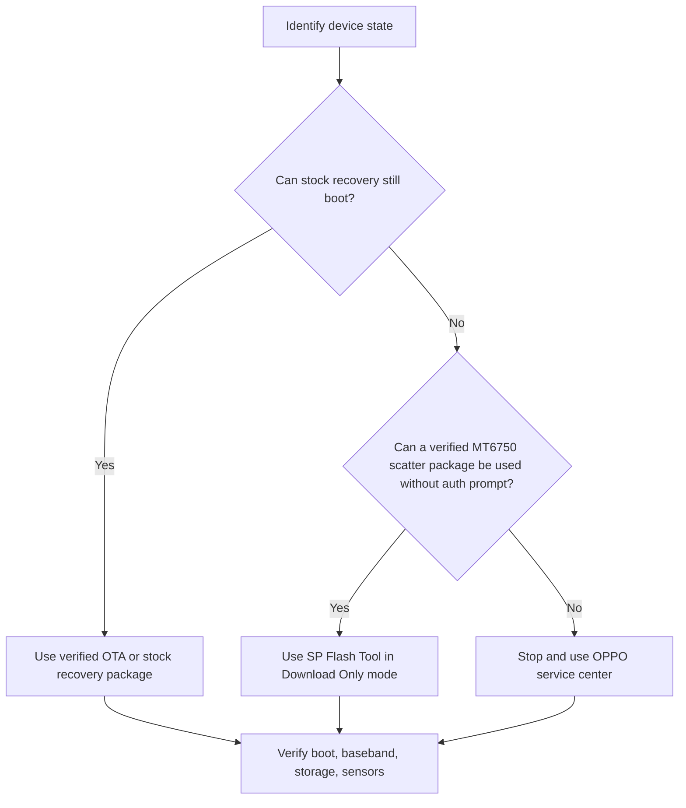

# Deep Research Report on OPPO A1601 Authentication Files and Recovery Packages

## Executive summary

The exact target appears to be **OPPO A1601**, which third-party firmware repositories consistently describe as **OPPO F1s** and most often suffix as **A1601EX**. I did **not** locate a clearly official, publicly downloadable, **A1601-specific `.auth` file** from current OPPO support surfaces or from the firmware repositories inspected in this session. What did surface instead were three categories of artifacts: legacy **stock/service firmware packages** for A1601/A1601EX, **OTA/recovery packages**, and a small number of **auth-adjacent third-party items** such as a generic NeedROM auth bundle and a HalabTech “No Auth Firmware” listing. citeturn22view1turn10view2turn14view2turn14view3turn6view0turn7view0

The most defensible practical conclusion is that, for legitimate recovery, you should prioritize **verified stock firmware or OTA packages** and **official service channels** rather than trying to source an unknown auth credential from mirror sites. Current official OPPO support pages emphasize **service-center** and **warranty/authenticity** workflows rather than public legacy firmware/auth distribution for an older model like the A1601. citeturn7view0turn6view3turn6view0

I also need to draw a clear boundary: I can help with **finding and validating legitimate firmware packages**, **checking whether a package already contains auth-related artifacts**, and **documenting safe recovery paths that do not defeat vendor protections**. I cannot provide instructions to bypass OPPO or MediaTek authentication, disable secure boot, or evade OEM security controls. The safer alternatives are included below. A prior internal research note informed and helped cross-check this report. fileciteturn0file0

## Scope, assumptions, and source quality

The user did not specify region, host OS, or preferred file format, so this report assumes **no region lock preference**, and it covers both **Windows** and **Linux** extraction/verification workflows. Because the discovered package names overwhelmingly use the export-style suffix **A1601EX**, I treat **A1601EX** as the most likely package family, while noting that I did not independently verify a separate regional variant map from OPPO. citeturn22view1turn10view2turn14view2

The search covered official OPPO support surfaces and several major firmware repositories that were directly accessible in this session: **OPPO Support**, **Android File Host**, **FirmwareFile**, **NeedROM**, **GSM-Firmware**, and **HalabTech**. Of these, only OPPO is a primary vendor source. NeedROM and Android File Host are uploader-driven platforms; FirmwareFile is an aggregator; GSM-Firmware and HalabTech are commercial repair/download repositories. That matters because the presence of a filename on a mirror site does **not** establish vendor provenance. citeturn6view0turn7view0turn10view0turn10view1turn10view2turn22view1turn14view1turn21view0turn21view1turn22view0

For the toolchain referenced below, the current stable versions visible from primary or official product pages at the time of writing are **7-Zip 26.02**, **Python 3.14.6**, and **Android SDK Platform-Tools 37.0.0**. For **SP Flash Tool**, the public page I could verify in-session advertises **v6.2404** and **v5.2404**, but that site is not a vendor-operated MediaTek domain, so I treat those version references as practical rather than authoritative. citeturn25view0turn27view0turn27view1turn27view2

## What the search actually found

The strongest model identification signal is that multiple repositories explicitly label the target as **“Oppo F1S A1601”** or **“Oppo F1S A1601EX”**. FirmwareFile lists **“Oppo A1601 F1S”** and names **MT6750**-based firmware packages, while NeedROM labels its page **“Oppo F1S A1601EX Official Firmware”** and its instructions reference **`MT6750_Android_scatter.txt`**. That is enough to treat **A1601 / A1601EX / F1s / MT6750** as the relevant recovery family for package validation. citeturn10view2turn22view1turn15view2

What I did **not** find was a vendor-hosted, model-specific public auth credential such as **`*.auth`**, **`auth_sv5.auth`**, or an OPPO-published A1601 auth package on current support pages. The current OPPO support surface I could inspect exposes **Service Center**, **Warranty Status**, **User Guide**, and other support links, but not a public legacy A1601 auth download. By contrast, the only `.auth` files I found are on a **generic NeedROM bundle** that explicitly describes itself as **GENERIC** and lists many unrelated OPPO models alongside A1601. citeturn6view0turn7view0turn6view3turn14view3turn15view0

The most important auth-adjacent discoveries were these. First, NeedROM hosts a **generic auth/DA bundle** titled **“PRELOADER AUTH DA FILE (BFT)”** whose description explicitly lists **`Auth_sv5.auth`**, **`New_sv5.auth`**, several **DA** binaries, and an OPPO model list that includes **A1601**. Second, HalabTech lists an **“OPPO A1601EX No Auth Firmware”** package. These are **not equivalent**. The NeedROM bundle is a broad generic repair archive, not an A1601-specific vendor credential, while HalabTech’s page is a third-party repository claim that a given firmware flow may avoid auth, not proof of an official OPPO auth release. citeturn14view3turn15view0turn15view1

Separately, I found a substantial number of potentially useful **firmware packages**. Those include Android File Host mirrors with published MD5 hashes for **A.16** and **A.33**, FirmwareFile references for **A.15** and **A.24**, NeedROM’s user-uploaded **A1601EX Official Firmware** page, GSM-Firmware entries for **OTA A.41** and **full A.41 RAR**, and HalabTech entries spanning **A.24**, **A.37**, **A.39**, **A.40**, **A.41**, **A.42**, and the “No Auth” listing. None of the firmware listings I could inspect explicitly state that the archive itself contains a standalone `.auth` file. citeturn10view0turn10view1turn10view2turn22view1turn14view1turn21view0turn14view2turn21view1turn22view0

## Download source inventory

The table below is limited to sources that were directly discoverable and inspectable in this session. The **“Contains auth file”** column is based on **page metadata and descriptions**, not full forensic unpacking of each archive. Where I could not verify contents directly, I say so explicitly.

| Site | Source page | URL | File name | Size | Checksum shown | Contains auth file | Credibility and notes |
|---|---|---|---|---:|---|---|---|
| OPPO Support | OPPO support portal | `https://support.oppo.com/en/` | N/A | N/A | N/A | No public A1601 auth file surfaced | Primary vendor support surface, but current pages emphasize service workflows rather than legacy A1601 downloads. citeturn6view0turn7view0turn6view3 |
| Android File Host | AFH download page | `https://androidfilehost.com/?fid=11410963190603863245` | `Oppo_F1S_A1601_(A1601EX_11_A.16_160920)_by_(FirmwareOS.com).zip` | 1.5 GB | MD5 `9a9615ad062a062eea00c6fd12a57388` | No auth file stated | User-uploaded mirror by “Shohag Malik.” Useful because it exposes an MD5, but not a primary source. citeturn10view0 |
| Android File Host | AFH download page | `https://androidfilehost.com/?fid=11410963190603863341` | `Oppo_F1S_A1601_(A1601EX_11_A.33_170814)_by_(FirmwareOS.com).zip` | 1.5 GB | MD5 `549bcb3680c7ed4ca16f15c4602cb9a7` | No auth file stated | Same trust posture as above: user-uploaded secondary mirror. citeturn10view1 |
| FirmwareFile | Firmware index page | `https://firmwarefile.com/oppo-a1601-f1s` | `Oppo_F1S_A1601_MT6750_EX_11_A.15_160913.zip` | 2 GB | None shown | No auth file stated | Aggregator says firmware package contains flash file, flash tool, USB driver, and manual, and names MT6750. Site also disclaims affiliation with device vendors. citeturn10view2 |
| FirmwareFile | Firmware index page | `https://firmwarefile.com/oppo-a1601-f1s` | `Oppo_F1S_A1601_MT6750_EX_11_A.24_161119.zip` | 2 GB | None shown | No auth file stated | Same page as above; useful for package naming and SoC family only. citeturn10view2 |
| NeedROM | Firmware page | `https://www.needrom.com/download/oppo-f1s-a1601ex-official-firmware/` | `Oppo F1S A1601EX Official Firmware` | Not shown on page | None shown | No auth file stated | User-uploaded page labeled **OFFICIAL**, but still listed by a NeedROM member and login-gated for download. Instructions reference `MT6750_Android_scatter.txt`. citeturn22view1turn15view2 |
| NeedROM | Generic auth bundle | `https://www.needrom.com/download/preloader-auth-da-file-bft/` | `PRELOADER AUTH DA FILE (BFT)` | Not shown on page | None shown | **Yes, generic only** | Description explicitly lists `Auth_sv5.auth`, `New_sv5.auth`, several DA binaries, and a model list including A1601. This is generic, not vendor-specific to A1601. citeturn14view3turn15view0 |
| GSM-Firmware | OTA mirror page | `https://gsm-firmware.com/index.php?a=downloads&b=file&id=62722` | `A1601EX_11_OTA_041_all_201912261125.zip` | 1.45 GB | None shown | No auth file stated | Third-party mirror with filename, date, and size. Useful for discovery; not a primary source. citeturn14view1 |
| GSM-Firmware | Full firmware page | `https://gsm-firmware.com/index.php?a=downloads&b=file&id=59518` | `A1601EX_11_A.41_191226.rar` | 1.58 GB | None shown | No auth file stated | Third-party full-firmware mirror, marked “Featured.” citeturn21view0 |
| HalabTech | Folder listing | `https://support.halabtech.com/index.php?a=downloads&b=folder&id=94604` | `OPPO A1601EX No Auth Firmware` | 2.00 GB | None shown | Not presented as `.auth`; marketed as “No Auth” | Third-party commercial repair repository. High practical relevance, low provenance confidence. citeturn15view1 |
| HalabTech | File page | `https://support.halabtech.com/index.php?a=downloads&b=file&id=311725` | `A1601EX_11_A.41_191226.tar.bz2` | 2.00 GB | None shown | No auth file stated | Third-party service firmware mirror. citeturn21view1 |
| HalabTech | File page | `https://support.halabtech.com/index.php?a=downloads&b=file&id=547512` | `A1601EX_11_A.42_210906.zip` | 1.63 GB | None shown | No auth file stated | Third-party service firmware mirror; later build than many other surfaced packages. citeturn22view0 |
| HalabTech | Folder listing | `https://support.halabtech.com/index.php?a=downloads&b=folder&id=94604` | `A1601EX_11_A.24_161119 Scatter firmware` | 1.28–1.30 GB | None shown | No auth file stated | Folder listing includes multiple A1601 scatter and OTA packages across branches. citeturn14view2 |

The overall pattern is clear. **Firmwares are easy to find; a trustworthy model-specific auth file is not.** The only actual `.auth` artifacts discovered here are bundled in a **generic NeedROM archive**, and the only A1601-specific auth-adjacent listing is a **third-party “No Auth” package**. That is not strong enough provenance to treat either one as a canonical OPPO solution. citeturn14view3turn15view0turn15view1

## How to verify and extract auth-related artifacts

Before flashing anything, verify that the archive actually belongs to the **A1601 / A1601EX / MT6750** family. The most useful indicators from the discovered pages are the package names themselves, the **F1s/A1601EX** labeling, and the reference to **`MT6750_Android_scatter.txt`**. If a package does not contain a scatter file for MT6750, or if the internal directory names do not line up with **A1601/A1601EX**, treat it as suspect. citeturn10view2turn22view1turn15view2

Recommended tools for verification and extraction are **7-Zip 26.02**, **Python 3.14.6**, and **Android SDK Platform-Tools 37.0.0**. For SP Flash Tool, use a current 5.x or 6.x build from a reputable source and prefer the version bundled by a trusted firmware provider only if you have already validated the package. citeturn25view0turn27view0turn27view1turn27view2

### Windows extraction and inspection

```powershell
# 1) Compute checksums before extraction
Get-FileHash .\A1601EX_11_A.41_191226.rar -Algorithm SHA256
Get-FileHash .\Oppo_F1S_A1601_(A1601EX_11_A.16_160920)_by_(FirmwareOS.com).zip -Algorithm MD5

# 2) List archive contents without extracting
7z l .\A1601EX_11_A.41_191226.rar
7z l .\A1601EX_11_A.42_210906.zip

# 3) Search extracted tree for auth-adjacent artifacts
7z x .\A1601EX_11_A.41_191226.rar -o.\a1601_fw
Get-ChildItem .\a1601_fw -Recurse -Include *.auth,custom.bin,*DA*,*scatter*.txt,preloader*.bin |
    Select-Object FullName,Length

# 4) Inspect scatter/platform clues
Select-String -Path .\a1601_fw\**\*scatter*.txt -Pattern "platform|MT6750|preloader" -CaseSensitive:$false
```

### Linux extraction and inspection

```bash
# 1) Compute checksums before extraction
sha256sum A1601EX_11_A.41_191226.rar
md5sum Oppo_F1S_A1601_'(A1601EX_11_A.16_160920)'_by_'(FirmwareOS.com)'.zip

# 2) List contents without extracting
7z l A1601EX_11_A.41_191226.rar
7z l A1601EX_11_A.42_210906.zip

# 3) Extract and search for auth-related files
mkdir -p a1601_fw
7z x A1601EX_11_A.41_191226.rar -oa1601_fw
find a1601_fw -iregex '.*\.\(auth\|bin\|img\|txt\)$' | grep -Ei 'auth|custom\.bin|DA|scatter|preloader'

# 4) Inspect the scatter file for platform identity
grep -RinE 'platform|MT6750|preloader' a1601_fw/*scatter*.txt a1601_fw 2>/dev/null
```

A package should only be treated as a plausible A1601 recovery candidate if these checks line up: the archive name maps to **A1601/A1601EX**, it contains a **MediaTek scatter** that references **MT6750**, and any boot-critical pieces such as a **preloader** are clearly in the same family. By contrast, if the package contains only a generic `.auth` collection or references many unrelated models, it should be treated as **research material**, not as a trustworthy device-specific auth source. citeturn10view2turn15view2turn14view3turn15view0

## Recovery paths that do not rely on defeating authentication

The safest legitimate recovery workflow is the one that **does not require bypassing vendor protections at all**. In practice, that means first trying a verified stock recovery or stock firmware path, and moving to OPPO service only if your toolchain demands auth credentials you cannot source from a trustworthy channel. OPPO’s current official support pages steer users toward **Service Center** and **Warranty Status** rather than public legacy auth downloads, so official service remains the cleanest escalation path when authentication becomes the blocking issue. citeturn7view0turn6view3



### Stock recovery or OTA route

If the device still boots into stock recovery, that is the lowest-risk route. Use only a package whose naming and branch clearly match the A1601/A1601EX family, keep a full backup if accessible, and avoid mixing recovery ZIPs with service-package instructions. The sources surfaced here show both OTA-style packages such as **`A1601EX_11_OTA_041_all_201912261125.zip`** and full service firmware such as **`A1601EX_11_A.41_191226.rar`** or **`.tar.bz2`**; those are not interchangeable. citeturn14view1turn21view0turn21view1turn22view0

### Verified scatter-flash route when no auth prompt appears

If stock recovery is unusable but you have a validated **MT6750 scatter** package, a cautious **SP Flash Tool** workflow is the next legitimate option. The NeedROM A1601EX page specifically instructs users to load **`MT6750_Android_scatter.txt`**, choose **“Download Only,”** then connect the powered-off phone while holding **Volume Up**. The SP Flash Tool instructions page likewise recommends loading the scatter file, using the download flow, and **deselecting preloader** because flashing `preloader.bin` may brick the device. citeturn22view1turn15view2turn27view2

A conservative step sequence is:

1. Verify the firmware with the extraction workflow above.  
2. Install the MediaTek USB driver and extract SP Flash Tool. citeturn10view2turn27view2  
3. Launch **`flash_tool.exe`**. citeturn22view1turn27view2  
4. Load **`MT6750_Android_scatter.txt`**. citeturn15view2turn22view1  
5. Select **Download Only**. citeturn22view1  
6. **Deselect `preloader`** unless you are absolutely certain the board and preloader family match. citeturn27view2  
7. Connect the powered-off phone while holding the volume key indicated by the validated package instructions. citeturn22view1turn27view2  
8. After completion, confirm that the device boots and that key functions such as storage and radio identifiers are intact.  

### When the tool asks for an auth file or custom DA

This is the stop point. If your flasher explicitly demands an **Auth File**, **custom DA**, or **custom bin**, and you do not already have a **trustworthy, model-matched, legally obtained** source, the safer recommendation is to **stop** rather than improvising with a generic bundle. The generic NeedROM auth pack is not specific enough to treat as authoritative for A1601, and the HalabTech “No Auth” listing is not a vendor release. In that situation, OPPO service is the lower-risk path. citeturn14view3turn15view0turn15view1turn7view0

## Legal, warranty, and operational risks

OPPO’s official support surfaces provide **warranty/authenticity checking** and **service-center routing**, which is the clearest visible signal of the company’s preferred repair channel for support-sensitive cases. That matters because unauthorized flashing, especially with ambiguous mirror packages, can jeopardize supportability and can also make a recoverable phone harder to restore if critical boot components are overwritten incorrectly. citeturn6view3turn7view0

The provenance risk here is unusually important. Android File Host files are uploaded by an individual account, NeedROM firmware is member-posted and login-gated, FirmwareFile is an aggregator that explicitly states it is **not endorsed by, owned by, or affiliated with** the handset brands it lists, and GSM-Firmware/HalabTech are repair-download services rather than primary OEM archives. That does not make them useless, but it does mean they should be treated as **secondary mirrors requiring local verification**, not as ground truth. citeturn10view0turn10view1turn22view1turn10view2turn14view1turn21view0turn21view1turn22view0

The strongest practical recommendation is therefore straightforward. If your goal is **legitimate recovery** of an OPPO A1601, focus on: validating whether your package is truly **A1601/A1601EX for MT6750**; using a **stock OTA or verified scatter package** when no auth prompt is involved; and escalating to an **OPPO service center** when the process requires vendor authentication that you cannot source from a trustworthy, authorized channel. On the evidence available in this session, I did **not** find a clearly official public A1601-specific auth file, and the discovered auth-related alternatives are too generic or too weakly sourced to recommend as canonical OEM material. citeturn10view2turn22view1turn14view3turn15view0turn15view1turn7view0turn6view3